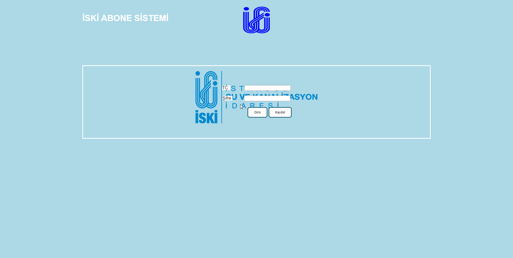
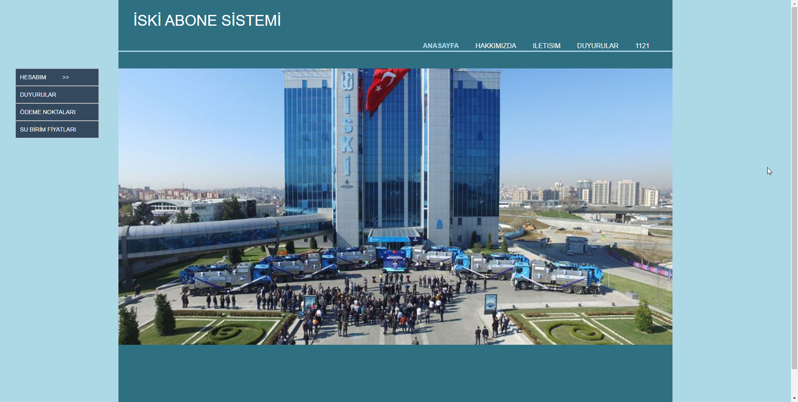
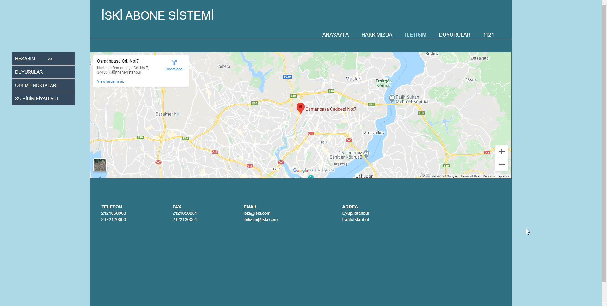
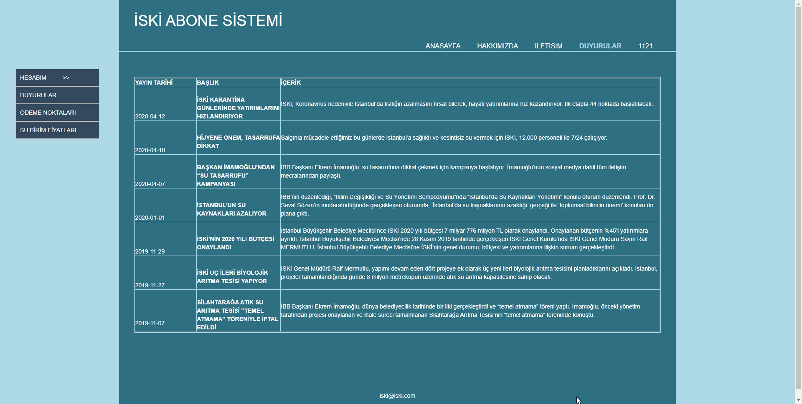
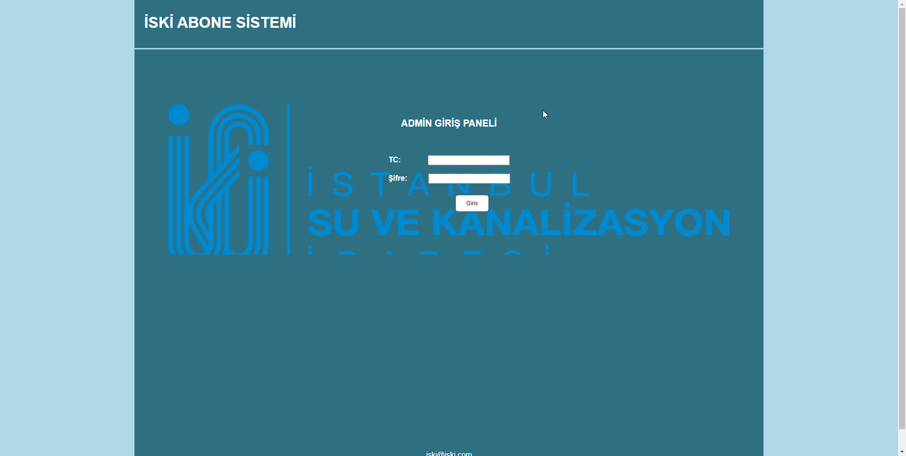
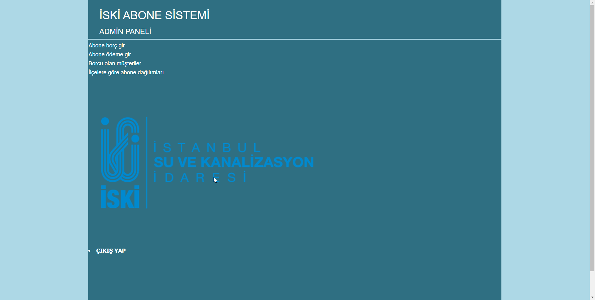
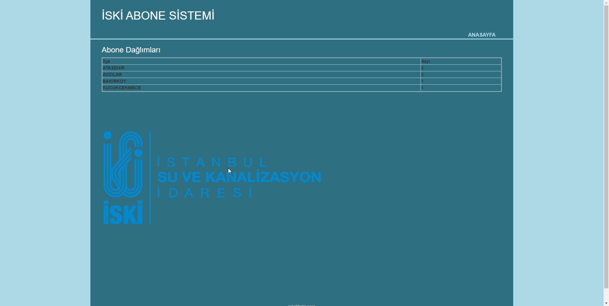

# İski Abone Sistemi

- İski abonelerinin temel ihtiyaçlarını karşılayabileceği (borç görüntüleme, geçmiş ödeme görüntüleme ödeme noktaları görüntüleme vb.) işlemler yapılabilir.
- Admin ve kullanıcı paneli olarak hazırlandı.
- Proje içinde iski adında DB bulunur.

## Kullanılan Platformlar 
- IDE : Netbeans 8.0.2 
- Server : Glassfish Server 4.1.2 
- Database : JDBC (Java DB)

## Bazı Ekran GÖrüntüleri

- Kullanıcı giriş sayfası:

- Kullanıcı ana sayfası:

- Kullanıcı iletişim sayfası: (Google API kullanıldı)

- Duyurular sayfası:

- Admin giriş sayfası:

- Admin ana sayfası:

- Admin abone dağılımı görüntüleme sayfası:

